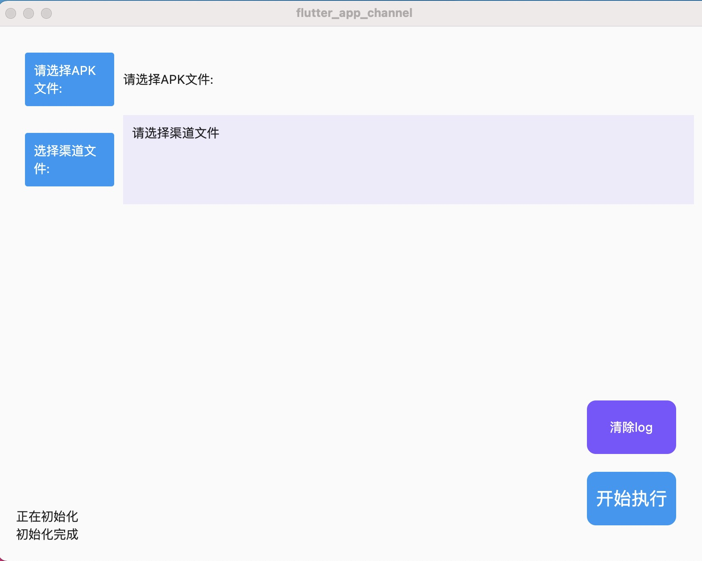

# Android多渠道可视化打包工具(macos平台)

 flutter_app_channel是基于美团分包工具瓦力来开发的android apk 渠道分包工具,运行需要依赖java环境,目前只支持在苹果电脑macos上运行
 需要在android项目中引用[瓦力walle](https://github.com/Meituan-Dianping/walle) 来获取添加的渠道
 
 
 flutter_app_channel is a flutter project to add channel for android apk,it need work with  [瓦力walle](https://github.com/Meituan-Dianping/walle) 
 now it just can run on macOS ,it will support Microsoft Windows OS  

## Getting Started

it requires java environment
channel file simple [渠道文件样例channe file demo](https://github.com/Meituan-Dianping/walle/blob/master/app/channel)
apks output file will open after add channel

